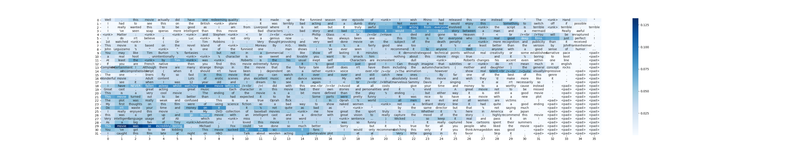

IMDB Classification with GRU + Self-attention
===
This is the implementation of IMDB classification task written in PyTorch. The model adopts GRU and self-attention mechanism.

## Requirements
* PyTorch
* TorchText

## How to Run
`python train.py`

## Result
I iterated five epochs of training. The results are shown as below.

* With self-attention
```
| Epoch: 01 | Train Loss: 0.624 | Train Acc: 63.72% | Val. Loss: 0.417 | Val. Acc: 81.53% |
| Epoch: 02 | Train Loss: 0.349 | Train Acc: 85.04% | Val. Loss: 0.353 | Val. Acc: 84.52% |
| Epoch: 03 | Train Loss: 0.242 | Train Acc: 90.36% | Val. Loss: 0.270 | Val. Acc: 89.53% |
| Epoch: 04 | Train Loss: 0.180 | Train Acc: 93.20% | Val. Loss: 0.293 | Val. Acc: 87.82% |
| Epoch: 05 | Train Loss: 0.134 | Train Acc: 94.97% | Val. Loss: 0.284 | Val. Acc: 89.95% |
| Test Loss: 0.298 | Test Acc: 89.41% |
```

* Without self-attention
```
| Epoch: 01 | Train Loss: 0.713 | Train Acc: 52.16% | Val. Loss: 0.728 | Val. Acc: 51.38% |
| Epoch: 02 | Train Loss: 0.652 | Train Acc: 59.73% | Val. Loss: 0.538 | Val. Acc: 72.95% |
| Epoch: 03 | Train Loss: 0.370 | Train Acc: 83.81% | Val. Loss: 0.321 | Val. Acc: 87.03% |
| Epoch: 04 | Train Loss: 0.258 | Train Acc: 89.67% | Val. Loss: 0.303 | Val. Acc: 86.84% |
| Epoch: 05 | Train Loss: 0.193 | Train Acc: 92.56% | Val. Loss: 0.358 | Val. Acc: 87.17% |
| Test Loss: 0.376 | Test Acc: 86.76% |
```

## Note
You can use trained weights for the models. Those are stored in `./weight/weight_w_attention.pth` and `./weight/weight.pth`, respectively.

## Attention Visualization
I have added a feature to visualize self-attention weights. You can use this feature by just running `python train.py`. And, you'll find visualized figures in `./fig/`.

A sample image is shown below:  


More details are available in [my blog post](https://gucci-j.github.io/SA-Visualization/).


## License
[MIT](./LICENSE)